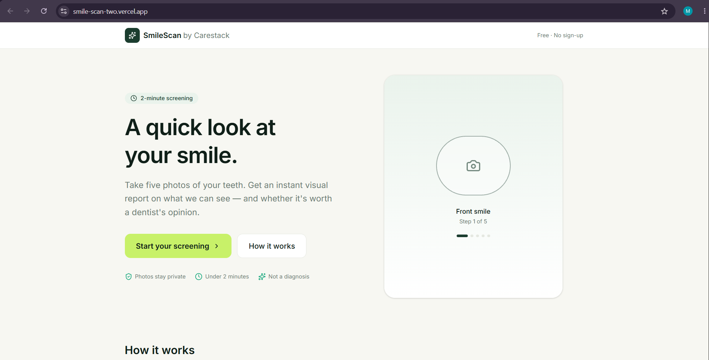
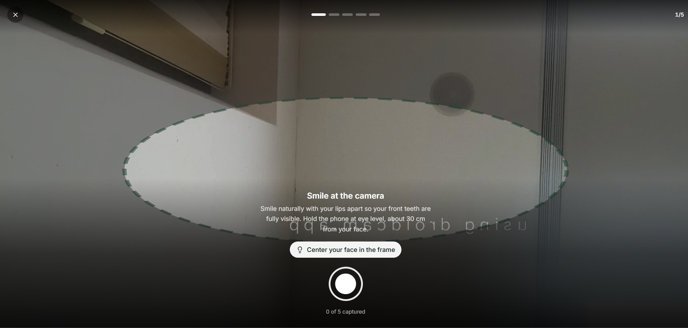
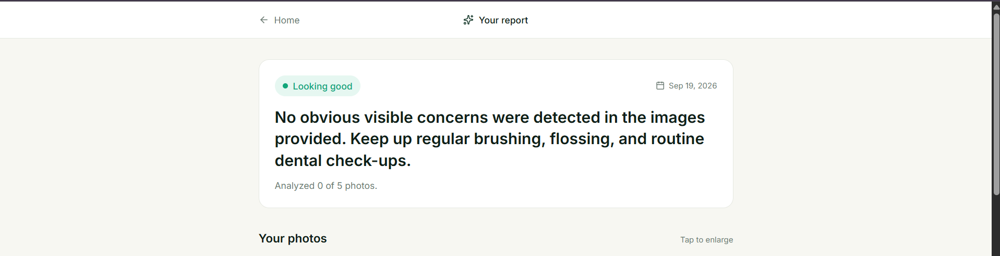
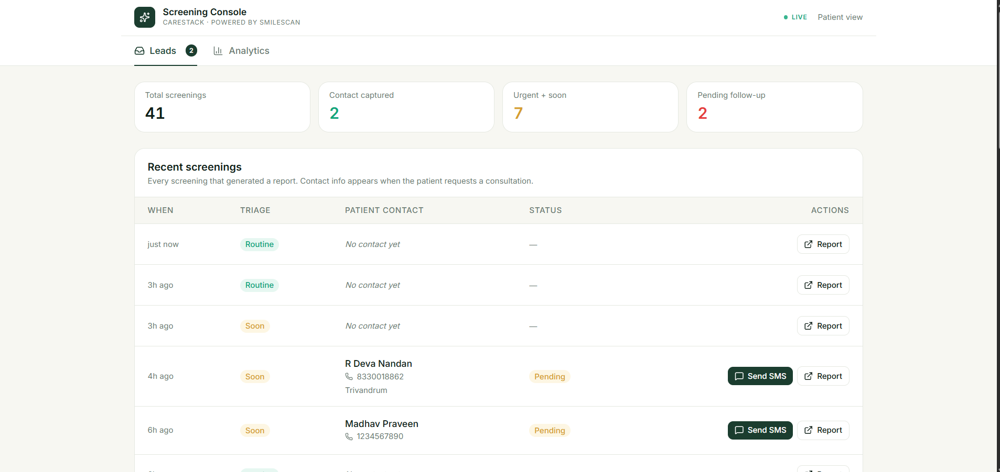

# SmileCare

### **DSOLVE 2026** · DRISHTI · College of Engineering Trivandrum (CET)

**BUILD. SOLVE. DEMONSTRATE.**

|                   |                                           |
| ----------------- | ----------------------------------------- |
| **Problem:**      | Problem 1: Oral Health Screening Widget   |
| **Team Name:**    | SN 1054                                   |
| **Team Members:** | Madhav Praveen · Keerthana Pradeep · R Deva Nandan · Karthik R |
| **Institution:**  | Sree Chitra Thirunal College of Engineering |
| **Live Demo:**    | https://smile-scan-two.vercel.app/  |
| **Pitch Video:**  | https://www.instagram.com/reels/DdcmkuiTgKl/         |

---

## Table of Contents

- [Problem Statement](#problem-statement)
- [Our Solution](#our-solution)
- [Key Features](#key-features)
- [Screenshots & Demo](#screenshots--demo)
- [Tech Stack](#tech-stack)
- [Getting Started](#getting-started)
- [Usage / Demo Script](#usage--demo-script)
- [Limitations & Future Scope](#limitations--future-scope)
- [Team](#team)
- [Submission Checklist](#submission-checklist)

---

## Problem Statement

**Problem 1: Oral Health Screening Widget**

Develop a free, two-minute oral health screening widget for web or smartphones that guides patients through a simple set of prompts and captures five quick images of their teeth. 

The solution should analyse these images and generate an instant visual report highlighting potential oral health concerns such as crooked teeth, tooth wear, or discoloration. The goal is to provide patients with an easy, accessible way to get an initial visual assessment of their oral health and understand whether they may need to consult a dentist.


### Why this matters

Dental issues are invisible until they hurt. By the time a patient books a visit, treatment is complex and expensive. Carestack's 3,000+ dental practices spend crores every year on patient acquisition — but the bottleneck isn't traffic, it's **qualifying** it. Half of website visitors bounce without identifying a need. Reception staff waste hours on unqualified calls. Meanwhile, patients with visible dental concerns stay home, unsure whether their issue is worth a visit.

SmileCare flips the funnel. The patient gets a free, immediate answer. The practice gets a triaged, contactable lead. Both sides win in 90 seconds.

---

## Our Solution

**SmileCare is a white-label patient acquisition engine for Carestack clinics.**

It's not a consumer app. It's a widget that any Carestack-powered practice embeds on their own website. A visitor gets a free 2-minute oral health screening — 5 guided photos, an AI-generated report highlighting visible findings, and a one-tap booking request. The practice gets a live operations dashboard showing who to call, why, and with what contact information.

**The dashboard is the product. The widget is how patients arrive.**

Unlike standalone consumer tools (e.g., eDentist), SmileCare is B2B SaaS. It brings patients **to the practice's own site** and hands the practice a name and a phone number in its existing console.

---

## Key Features

- **Guided 5-photo capture** — live on-device face detection draws a guide overlay and gives real-time feedback ("Move closer", "Open wider", "Hold still") so every photo is captured correctly
- **Instant AI report** — findings with severity, confidence, evidence, and location, generated in under 3 seconds using Agnes AI's vision model
- **Annotated photos** — bounding boxes on captured images show exactly where each finding was detected
- **Triage-aware messaging** — the report's tone and language adapt to severity (`routine`, `soon`, `urgent`), and every report carries a mandatory disclaimer
- **Live clinic dashboard** — a leads table with contact info, triage level, one-tap **Send SMS**, and direct access to each patient's full report
- **Privacy-first** — user-controlled photo deletion from the report page; photos auto-purge after 24 hours if no booking is made


---

## Screenshots & Demo

### Patient Experience


*Landing page — a 2-minute promise with clear trust signals and a single call to action.*


*Guided capture — live face detection frames each shot with real-time feedback.*


*Instant report — triage badge, annotated photos, and findings with severity and confidence.*

### Clinic Dashboard


*Operations console — live leads table with contact info and one-tap Send SMS.*

### Pitch Video

https://www.instagram.com/reels/DdcmkuiTgKl/
---

## Tech Stack

| Layer           | Technology                          | Why we chose it |
| --------------- | ----------------------------------- | --------------- |
| Frontend        | Next.js 16 (App Router) + TypeScript | SSR for SEO, co-located API routes, one repo, one deploy |
| Styling         | Tailwind CSS v4 + shadcn/ui patterns | Matches Carestack brand palette, zero runtime cost |
| State           | Zustand                             | Lightweight global state for the multi-step capture flow |
| Face Detection  | MediaPipe Tasks Vision              | On-device, no server calls, works on low-end phones |
| Backend         | Next.js API Routes (serverless)     | Co-located with frontend, no separate deploy |
| Database        | Supabase Postgres                   | Free tier, real-time subscriptions, generous limits |
| File Storage    | Supabase Storage (private bucket)   | Signed URLs with 1-hour expiry |
| ML / AI         | Agnes AI — `agnes-2.5-flash`        | Vision-capable, unlimited free tier, OpenAI-compatible API |
| Image Processing | sharp                              | Fast native resizing and JPEG optimization before AI calls |
| Infra / Hosting | Vercel                              | Zero-config Next.js deploys, edge network, auto HTTPS |

---

## Getting Started

### Prerequisites

- **Node.js ≥ 20.x** ([download](https://nodejs.org/))
- **npm** (bundled with Node)
- **Supabase account** — free at [supabase.com](https://supabase.com)
- **Agnes AI API key** — free at [platform.agnes-ai.com](https://platform.agnes-ai.com/)

### Installation

```bash
# 1. Clone the repository
git clone https://github.com/MadhavPraveenfr/SmileScan.git
cd SolutionTemplate

# 2. Install dependencies
npm install

# 3. Create your environment file
cp .env.example .env.local
# Fill in your real values (see Environment Variables section below)

# 4. Apply the database schema
# Open Supabase → SQL Editor → paste the SQL from the Database Schema section of this repo
# (See docs/schema.sql or the "Setup" section of the internal README)

# 5. Create the storage bucket
# Supabase → Storage → New bucket → name it "oral-scans" (keep it PRIVATE)

# 6. Run the dev server
npm run dev

### Environment Variables

| Variable                    | Description                       | Example                            |
| --------------------------- | --------------------------------- | ---------------------------------- |
| `SUPABASE_URL`              | Supabase project URL              | `https://xxxxx.supabase.co`        |
| `SUPABASE_SERVICE_ROLE_KEY` | Backend-only key (bypasses RLS)   | `eyJhbGciOiJIUzI1NiIsInR5cCI6...`  |
| `AGNES_API_KEY`             | Agnes AI API key                  | `sk-xxxxxxxxxxxxxxxx`              |


---

## Usage / Demo Script

1. **Boot** — open two browser tabs: the patient view at `/` and the clinic console at `/metrics`. Have a phone ready with the live URL open for a real-camera demo.

2. **Walkthrough step 1 (patient)** — land on the Carestack-themed hero, click **Start your screening**, skim the preparation tips, then click **I'm ready — open camera**.

3. **Walkthrough step 2 (capture)** — the live camera shows a guide oval. Move your face; the feedback pill updates in real-time ("Move closer", "Looks good — hold still"). Tap the shutter 5 times through the 5 angles, then submit from the review screen.

4. **Highlight ** — the report renders in ~2 seconds with a triage badge, annotated photos, and a findings list with severity . Fill in the booking form. Then **flip to the console tab** — the lead you just created appears at the top of the leads table with **Send SMS** and **Report** actions. In 90 seconds, an anonymous visitor became a triaged, contactable lead in the practice's dashboard.

5. **Wrap-up** — "This isn't a widget. It's a white-label acquisition engine Carestack sells to every clinic on its network. The dashboard is what the clinic owner renews for."

---

## Limitations & Future Scope

### Known Limitations

- **Screening, not diagnosis** — the AI describes visible signs ("discoloration", "crowding") but never diagnoses. Every report carries a disclaimer, and the prompt explicitly forbids diagnostic terms like "cavity" or "caries".
- **Accuracy depends on photo quality** — good lighting and framing matter. The on-device quality checks and real-time guide overlays mitigate this, but blurry photos reduce confidence.
- **AI free tier has rate limits** — bursts of new users can hit throttling. The SHA-256 cache mitigates this for repeat screenings.


### Future Scope

- **Carestack CRM integration** — push leads directly into the practice's patient records via Carestack's API
- **Geo-routing** — automatically match patients to the nearest Carestack clinic
- **Multilingual support** — Hindi, Tamil, Malayalam for pan-India rollout

---

## Team

| Name              | Role(s)               | GitHub           | Email   |
| ----------------- | --------------------- | ---------------- | ------- |
| Madhav Praveen    | Backend + AI pipeline | @MadhavPraveenfr | Madhav.prfr@gmail.com |
| Keerthana Pradeep | Frontend + Design + Documentation     | @Keerthana-0507        | Keerthanapp0507@gmail.com |
| R Deva Nandan     | Frontend + Camera accessibility                |   dev-by-deva     | devanandansct2006@gmail.com |
| Karthik R         | Backend + Integration                | @KarthikR        | karthikchackai@gmail.com |

---

## Submission Checklist

- [x] Clean, runnable source code committed to this **public** repo
- [x] `README.md` fully filled in (all sections above)
- [x] Pitch video (>30s, English) posted on team member's social profile tagging **@DrishtiCET** & **@CareStack** and link added above
- [x] All secrets/API keys removed from the repo (`.env.local` gitignored; only `.env.example` committed)
- [x] Quick-start verified from a fresh clone (`git clone` → `npm install` → `npm run dev` → works)

---

**[Problem Statements](./docs/problem-statements.md)** ·
**[Submission Checklist](./SUBMISSION_CHECKLIST.md)** ·
**DSOLVE 2026 Guidelines**